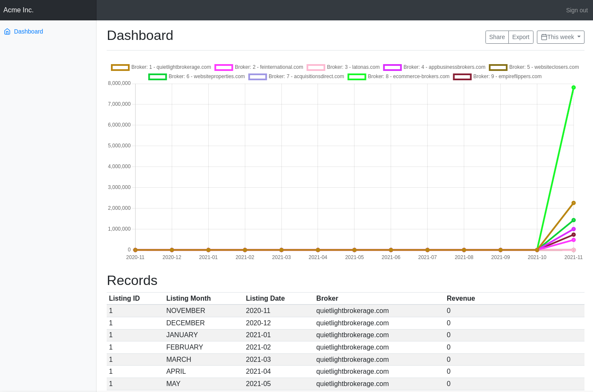

# Shopkeeper Challenge

You are tasked with building a dashboard that analyzes different businesses. The dashboard will help users understand the number of new listings created per month for each website (or "broker") that is crawled, as well as the average revenue per listing.

## Challenge

As a user of the proposed website, I would like to answer the following question:

**"How many new listings per month are created for each of the websites (or "brokers" – the two terms are interchangeable) that we crawl, and what is the average revenue per listing?"**

To address this, please provide the following:

1. A line graph plotted monthly, where each website/broker has its own line (in a unique color) plotted from November 2020 through November 2021.
2. A data table supporting these line graphs, with the following columns:

   - **Listing ID**
   - **Listing Month**
   - **Listing Date**
   - **Broker**
   - **Revenue**

   The table should support columns that can be sorted and/or filtered.

## Stack

The following technologies are used in this project:

- **ExpressJS**: Server-side framework for Node.js.
- **Handlebars**: Template engine for generating HTML.
- **ChartJS**: JavaScript library for creating graphs and charts.
- **pg (PostgreSQL)**: Node.js client for interacting with a PostgreSQL database.

## Instructions

Follow these steps to set up and run the project locally:

```sh
git clone https://github.com/xochilpili/shopkeeper-challenge.git
cd shopkeeper-challenge
npm install
cp .env-example .env
npm run build
npm run start
```

## Using docker

```sh
docker build -t shopkeeper:main -f Dockerfile .
docker run --rm -e HOST=0.0.0.0  -e PORT=3000 -e DB_HOST= -e DB_PORT=5432 -e DB_USERNAME="" -e DB_PASSWORD="" -e DB_NAME="" -p 3000:3000 shopkeepr:main
```

## Screenshot



## What's missing

- Filter table 😞
- Write tests 😿
